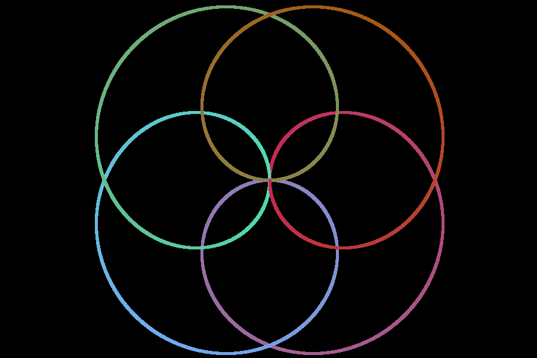
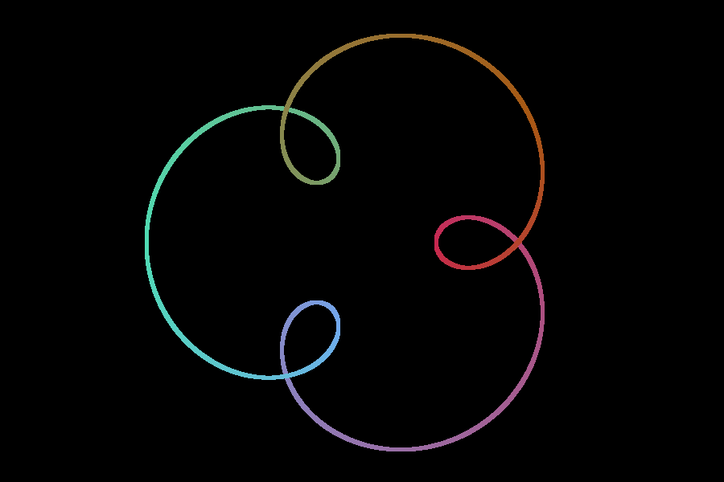
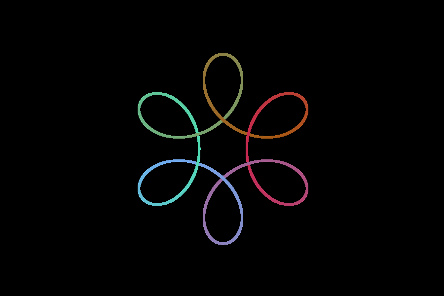
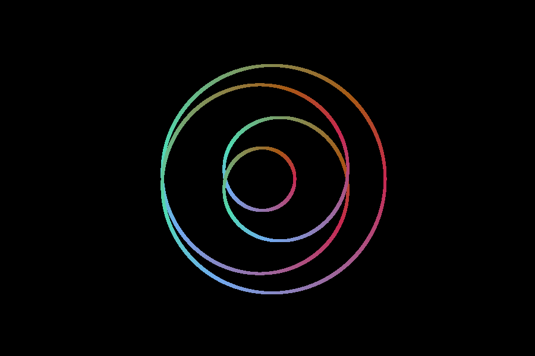

# Client Engineer Examination: Unity Graphics
> Created By Mohd Naim Shah

This examination evaluates your core Unity development skills and the ability to visualize math equations.

## Task 1: Spirograph

1.  **Introduction:**

    - Spirograph is a geometric drawing device that produces mathematical roulette curves of the variety technically known as hypotrochoids and epitrochoids. [Wiki](https://en.wikipedia.org/wiki/Spirograph)
    - By rotating multiple axes of varying lengths and speeds, a multitude of harmonic patterns can be created.

2.  **Unity Scene Setup:**

    - Create a new Unity project and scene.

3.  **Implementation Details:**

    - Draw a simple 2-axle spirograph pattern generated with the given parameters:

        - Radius of the fixed circle **(R)**
        - Radius of the rolling circle **(r)**
        - Distance from the center of rolling circle to drawing point **(d)**
    
    - Utilize Unity's UI system to design input fields, sliders, or other suitable controls for parameter input.

    - Implement animation to dynamically illustrate the generation of the spirograph pattern.

4.  **Reference Images:**

| A                             | B                            | C                             | D                             |
| ----------------------------- | ---------------------------- | ----------------------------- | ----------------------------- |
|  |  |  |  |

## Extension Task (Bonus)

-   **Presets:**

    -   Implement a set of presets or templates at the start. These presets should align with the patterns depicted in the reference images.

-   **Colors**

    -   Utilize vibrant color schemes to enhance the attractiveness of the generated pattern.
    

## Evaluation Criteria

-   **Functionality:** The core task requirements are met, and the scene demonstrates successful pattern generation.
-   **Code Quality:** Code is well-organized, readable, and includes meaningful comments where necessary.
-   **Visual:** Correctly illustrate the generation of the spirograph pattern.
-   **Unity Proficiency:** Exhibits good use of Unity components, UI systems, and general Unity workflows.
