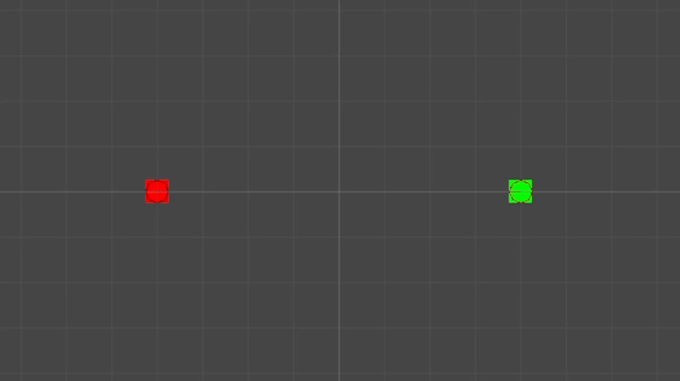

# Client Engineer Examination: Unity Physics
> Created By Mohd Naim Shah

This examination assesses your fundamental Unity development abilities and your capability to replicate physics scenarios.

## Task 2: MLRS vs CIWS

1.  **Introduction:**

    - A multiple launch rocket system (MLRS) is a type of rocket artillery system that contains multiple launchers which are fixed to a single platform, and shoots its rocket ordnance in a fashion similar to a volley gun. [Wiki](https://en.wikipedia.org/wiki/Multiple_rocket_launcher)
    - A close-in weapon system (CIWS) is a point-defense weapon system for detecting and destroying short-range incoming missiles which have penetrated the outer defenses. [Wiki](https://en.wikipedia.org/wiki/Close-in_weapon_system)

2.  **Unity Scene Setup:**

    - Create either a 2D or 3D Unity scene to simulate a battle between two tanks, where one tank utilizes MLRS while the other is equipped with CIWS. In this scenario, the MLRS tank will be attacking while the CIWS tank will be defending.

3.  **Implementation Details:**

    - Write a script to control how both tanks move sideways while facing each other in battle.
    
    - Implement the MLRS system for the attacking tank with these features:
      
      - Fire missiles aimed at the defending tank.
      - Missiles automatically track and lock onto their target using homing capabilities.
      - Missiles moves at a standard speed.
    
    - Implement the CIWS system for the defending tank with these features:
      
      - Detect incoming enemy homing missiles.
      - Shoot projectiles directly at enemy homing missiles to neutralize them.
      - Projectiles moves at high speed in a straight line.

4.  **Reference Images:**

|                    |
| ------------------ |
|  |

## Extension Task (Bonus)

-   **Control Panel**

    -   Create a UI to manage the simulation parameters allowing adjustment of the tanks' speed, homing missile speed, homing missile angle, and projectile speed.

-   **Effects**

    -   Please include simple effects to make the simulation look better visually.
    

## Evaluation Criteria

-   **Functionality:** The core task requirements are met, and the scene demonstrates accurate physics simulation.
-   **Code Quality:** Code is well-organized, readable, and includes meaningful comments where necessary.
-   **Visual:** Accurately depict physics behavior to simulate realistic combat scenarios.
-   **Unity Proficiency:** Exhibits good use of Unity components, UI systems, and general Unity workflows.
